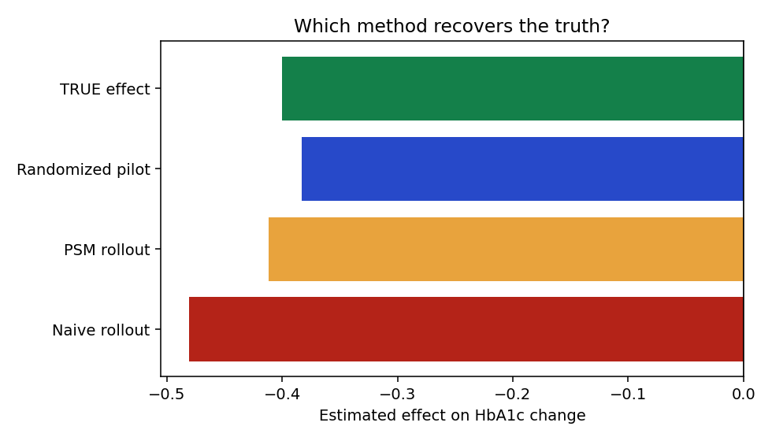

# Experimentation & Causal Inference Toolkit — A/B Testing at Scale

**A rigorous experimentation toolkit covering both online A/B testing (a job-seeker-journey product experiment) and offline causal inference (a clinical program evaluation) — CUPED variance reduction, sequential/always-valid testing, sample-ratio-mismatch checks, power/MDE, multiple-testing correction, heterogeneous treatment effects, and propensity-score matching — every method graded against a known ground-truth effect.**

> **In one breath (experimentation focus):** Built an end-to-end experimentation toolkit for a job-seeker-journey product test — randomized A/B analysis with sample-ratio-mismatch validation, CUPED variance reduction (15% tighter confidence intervals from a pre-experiment covariate), sequential/always-valid inference to prevent peeking-inflated false positives, power/MDE design, Benjamini-Hochberg correction across a metric suite, and heterogeneous-treatment-effect analysis surfacing that entry-level seekers respond 3.5x more — all validated by recovering a synthetically known effect, and complemented by an offline causal-inference case (propensity-score matching) for observational data.

## Two halves of experimentation rigor

| | Online experimentation (job-seeker journey) | Offline causal inference (clinical) |
|---|---|---|
| Setting | Randomized product A/B test | RCT pilot + confounded observational rollout |
| Methods | SRM, CUPED, sequential testing, power/MDE, BH, HTE | Welch/two-proportion tests, propensity-score matching, SMD balance |
| Code | [`python/ab_testing.py`](python/ab_testing.py), [`run_experiment.py`](python/run_experiment.py) | [`python/evaluate.py`](python/evaluate.py) |
| Run | `python python/run_experiment.py` | `python python/evaluate.py` |

Both share the same discipline: **methods are graded against a constructed ground truth**, so the toolkit validates the methodology, not just fits a model.

---

## Online experimentation — job-seeker journey (headline for A/B-testing roles)

A synthetic Indeed-style experiment: seekers randomized to control (current search ranking) vs. treatment (a new ranking algorithm), observed through the funnel (impression → click → apply → positive outcome), with a pre-experiment covariate for CUPED.

```bash
python python/run_experiment.py         # SRM -> primary test -> CUPED -> sequential -> power -> BH -> HTE
python python/experiment_dashboard.py   # stakeholder readout -> results/experiment_dashboard.html
```

Verified results (reproducible, seeded):

| Analysis | Result |
|---|---|
| Sample Ratio Mismatch | PASS (treat share 50.09%, randomization trustworthy) |
| Apply-rate lift (primary) | **+2.05 pp** (7.0%), p ≈ 1e-14; **95% CI covers the true +2.0 pp** |
| CUPED variance reduction | **15.1%** (SE 0.0079 → 0.0073) from the pre-period covariate |
| Sequential testing | naive peek "significant" at n≈3k; always-valid boundary holds to n≈6k (peeking control) |
| Multiple testing | Benjamini-Hochberg across click / apply / outcome metrics |
| Heterogeneous effect | entry **+3.5 pp** vs mid +0.8 / senior +1.0 pp — target the segment that responds |

The standout methods — **CUPED** (variance reduction), **sequential/always-valid inference** (the peeking problem), **SRM** (the check that catches broken randomization), and **heterogeneous effects** (who to target) — are exactly what separates senior experimentation work from a one-off t-test. [`sql/experiment_metrics.sql`](sql/experiment_metrics.sql) provides the BigQuery funnel/SRM/segment queries the analysis runs on at warehouse scale.

---

## Offline causal inference — clinical program (observational methods)

### The design twist: known ground truth

The synthetic population is constructed with a **known true treatment effect** (HbA1c −0.40, ER visits ×0.80, cost −$600). Every method is graded on whether it recovers the truth — the evaluation validates the *methodology*, not just the program. Enrollment in the observational rollout is deliberately confounded (sicker members enroll more), so the naive comparison is wrong by construction and must be corrected.

## Results (all reproduce with the commands below)

| Analysis | Estimate (HbA1c effect) | 95% CI | Truth = −0.40 |
|---|---|---|---|
| Randomized pilot (n=4,000) | **−0.383** | [−0.418, −0.348] | ✅ in CI, p < 1e-90 |
| Naive rollout comparison | −0.481 | — | ❌ biased −0.081 (20% overstatement) |
| Propensity-matched rollout (6,093 pairs) | **−0.412** | [−0.432, −0.391] | ✅ in CI |

Supporting numbers: ER visit rate 25.9% vs 30.5% (p = 0.001); matched cost effect −$627 vs true −$600; pilot minimum detectable effect 0.054 at 80% power (well below the target effect — the pilot was properly powered). Covariate balance after matching: max |SMD| = 0.016 against the 0.1 threshold.



## Run everything

```bash
pip install -r requirements.txt
# Online experimentation (job-seeker journey)
python python/run_experiment.py        # SRM, primary test, CUPED, sequential, power, BH, HTE
python python/experiment_dashboard.py  # readout -> results/experiment_dashboard.html
# Offline causal inference (clinical)
python python/generate_population.py   # 24,000 members -> SQLite + CSV
python python/evaluate.py              # A/B + PSM -> results/evaluation.json + figures
Rscript r/validate.R                   # independent replication in base R
python -m pytest tests/ -q             # 13 method-validation tests (6 clinical + 7 experimentation)
```

## Structure

```
python/ab_testing.py           EXPERIMENTATION TOOLKIT: SRM chi-square, two-proportion
                               test, CUPED variance reduction, sequential/always-valid
                               testing, power/MDE, Benjamini-Hochberg, heterogeneous effects
python/job_seeker_experiment.py  synthetic job-seeker A/B with KNOWN effect + CUPED covariate
python/run_experiment.py       online-experiment orchestration
python/experiment_dashboard.py stakeholder experiment readout
sql/experiment_metrics.sql     BigQuery: SRM, funnel conversion, segment lift, CUPED prep
sql/cohort_queries.sql         SQL: clinical cohort views; confounding exposed, naive est. kept
python/generate_population.py  clinical population with constructed ground truth
python/evaluate.py             Welch/two-proportion tests, propensity matching, SMD balance
r/validate.R                   base-R replication of the primary clinical statistics
tests/                         13 truth-recovery gates across both halves
```

## Design choices worth noting

- **Methods graded against truth, enforced by tests.** `test_psm_corrects_the_bias` fails the build if matching stops recovering the constructed effect — methodology regression-tested like code.
- **The wrong answer is a deliverable.** The naive estimate is computed, reported, and kept in the SQL: showing stakeholders *why* the intuitive comparison misleads is half the job of program evaluation.
- **Power before p-values.** The MDE calculation answers "could this pilot even detect the effect we care about?" before any significance claim is made.
- **Cross-language replication.** R independently reproduces the t-test, proportion test, and power calculation from the same CSV — if Python and R disagree, the analysis is the problem, not the language.
- **SQL as the clinical audit surface.** Inclusion criteria live in views a clinical reviewer can read, not buried in pandas filters.

## Data & compliance

All members, outcomes, and effects are synthetic and seeded. No real patient, member, or clinical data is used or represented. This is a methods portfolio project, not clinical evidence.

---

*Francis Oluwatobi · oluwatobi.ou@gmail.com*
